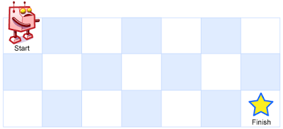

#### 一个机器人位于一个 m x n 网格的左上角 （起始点在下图中标记为“Start” ）。机器人每次只能向下或者向右移动一步。机器人试图达到网格的右下角（在下图中标记为“Finish”）。问总共有多少条不同的路径？

#### 举栗
```
上图是一个7 x 3 的网格。有多少可能的路径？
```

#### 解题
```
机器人只能向右或向下移动一步，那么当前路径数等于左边路径数+上边路径数之和，不过初始化第0行和第0列路径数都为1。
var uniquePaths = function (m, n) {
    let dp = new Array(m);
    // 初始化 第0行和第0列路径数都为1
    for (let i = 0; i < m; i++) {
        dp[i] = new Array(n);
        dp[i][0] = 1;
    }
    for (let i = 0; i < n; i++) {
        dp[0][i] = 1;
    }
    // 当前路径数等于左边路径数+上边路径数之和
    for (let i = 1; i < m; i++) {
        for (let j = 1; j < n; j++) {
            dp[i][j] = dp[i - 1][j] + dp[i][j - 1];
        }
    }
    return dp[m - 1][n - 1];
};
```