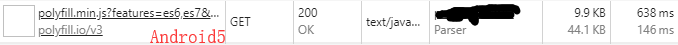
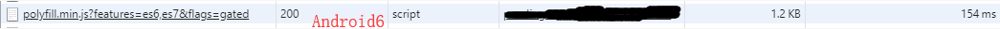
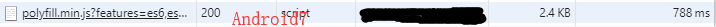

## 前言
近来项目上不是太忙，有时间进行了一些项目优化的工作，我觉得有必要记录一下，或许可以帮到需要的同学呢^_^。
## 实践
#### polyfill优化
babel的主要功能是语法转换 & polyfill兼容；我们的项目会有兼容清单，在使用webpack打包编译的时候就会将比较大的polyfill引入，
造成编译包体积变大，并且对于机型和浏览器比较新的用户来说他们不太需要polyfill；目前流行的几种解决方案是：
##### @babel/preset-env 按需加载
```
// .babelrc.js
module.exports = {
    "plugins": [
        [
            "@babel/plugin-transform-runtime",
            {
                "corejs": false, // 默认值，可以不写
                "helpers": true, // 默认，可以不写
                "regenerator": false, // 通过 preset-env 已经使用了全局的 regeneratorRuntime, 不再需要 transform-runtime 提供的 不污染全局的 regeneratorRuntime
                "useESModules": true, // 使用 es modules helpers, 减少 commonJS 语法代码
            }
        ]
    ],
    presets: [
        [
            "@babel/preset-env",
            {
                "modules": false, // 模块使用 es modules ，不使用 commonJS 规范 
                "useBuiltIns": 'usage', // 默认 false, 可选 entry , usage
            }
        ]
    ]
}
```

##### polyfill.io
使用 polyfill.io 的动态 polyfill 服务，保证只有在需要时，才会引入 polyfill，只需要外链一个 js：
```
<script src="https://polyfill.io/v3/polyfill.js?features=es6,es7&flags=gated"></script>
```

##### 注
我最终选择的polyfill.io方案，理由很简单，打包体积更小，应用更简单。 polyfill.io 的原理，它会根据你的浏览器 UA 头，判断你
是否支持某些特性，从而返回给你一个合适的 polyfill。上图看一下吧：






#### upgrade babel7
官方提供了一个工具babel-upgrade，对于已有的项目，只需要运行这样一行命令就可以了：
```
npx babel-upgrade --write --install
```

我项目中babelrc部分配置如下：
```
{
  "presets": [
    [
      "@babel/preset-env",
      {
        "loose": true,
        "modules": "cjs",//解决export报错
        "useBuiltIns": false//用了polyfill.io
      }
    ],
    "@babel/preset-react"
  ],
  "plugins": [
    "@babel/plugin-transform-runtime",
    ···
  ]
}
```

#### 应用prettier，规范团队代码风格
package.json
```
"husky": {
    "hooks": {
      "pre-commit": "lint-staged"
    }
  },
  "lint-staged": {
    "src/**/*.{js,css,less}": [
      "prettier --write",
      "git add"
    ]
  },
  "devDependencies": {
    "husky": "^1.3.1",
    "lint-staged": "^8.1.1",
    "prettier": "^1.15.3",
  }
```

.prettierrc
```
{
  "printWidth": 400,
  "tabWidth": 2,
  "singleQuote": true,
  "semi": true,
  "trailingComma": "none",
  "bracketSpacing": true
}

```
git commit的时候就会重置修改页面的样式

#### ant-mobile-design中轮播图点击跳转页面后无法继续播放了
这是bug在Android机型中普遍存在，解决方法是注销掉carousel组件的handleMouseOver事件

未完待续~