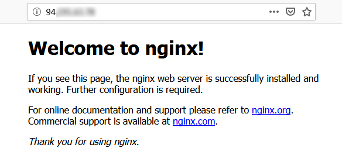

## 前端全栈之环境搭建

### 序言
    最近入手了腾讯云服务器，打算做点小项目练练手，因为会涉及环境搭建、项目选型等等比较琐碎的东东，所以记录一下吧~

### 域名管理
    申请(买入)域名、域名实名认证、域名工信部备案、域名公安网备案···

### 环境搭建
    买入云服务器的时候，服务器已经进行了默认的系统初始化(不是自己配置的话)，怎么安装nginx、mysql、node等这些工具呢，大体有两种方法：
```
1、安装现成的镜像环境文件如LNMP/JAVA···等
2、手动逐个安装···
```

    因为我是自己做点小项目，考虑灵活配置的缘故，我采用手动安装它们···，有条件的可以购买云数据库、流量等其他好的云产品···好了开始正题吧~

### 云服务器Nginx安装

1、执行以下命令，在 `/etc/yum.repos.d/` 下创建 `nginx.repo` 文件
```
//yum.repos.d是包管理工具yum安装各种应用的配置文件夹
vi /etc/yum.repos.d/nginx.repo
```

2、按 “i” 或 “Insert” 切换至编辑模式，写入以下内容(CentOS 7.6 请写入以下内容)
```
[nginx] 
name = nginx repo 
baseurl = https://nginx.org/packages/mainline/centos/7/$basearch/ 
gpgcheck = 0 
enabled = 1
```

3、按 “Esc”，输入 “:wq”，保存文件并返回

4、yum install nginx

5、执行以下命令，打开 `nginx.conf` 文件
```
vim /etc/nginx/nginx.conf
```

6、按 “i” 或 “Insert” 切换至编辑模式，对应使用的操作系统编辑 nginx.conf 文件，配置 Nginx，实现与 PHP 的联动
```
//找到 nginx.conf 文件中的 #gzip on;，另起一行并输入以下内容
server {
    listen       80;
    root   /usr/share/nginx/html;
    server_name  localhost;
    #charset koi8-r;
    #access_log  /var/log/nginx/log/host.access.log  main;
    #
    location / {
        index index.php index.html index.htm;
    }
    #error_page  404              /404.html;
    #redirect server error pages to the static page /50x.html
    #
    error_page   500 502 503 504  /50x.html;
    location = /50x.html {
    root   /usr/share/nginx/html;
    }
    #pass the PHP scripts to FastCGI server listening on 127.0.0.1:9000
    #
    location ~ .php$ {
    fastcgi_pass   127.0.0.1:9000;
    fastcgi_index  index.php;
    fastcgi_param  SCRIPT_FILENAME  $document_root$fastcgi_script_name;
    include        fastcgi_params;
    }
}
```

7、按 “Esc”，输入 “:wq”，保存文件并返回

8、依次执行对应命令启动 Nginx 并设置为开机自启动
```
systemctl start nginx
systemctl enable nginx
```

9、在浏览器中，输入云服务器实例公网 IP，查看 Nginx 服务是否正常运行


### 云服务器Mysql安装

1、执行以下命令，查看系统中是否存在 MariaDB 现有包
```
rpm -qa | grep -i mariadb
```

2、如果执行上述命令后有返回结果则删除它们：
```
yum -y remove 包名
```

3、开始安装，执行以下命令，在 `/etc/yum.repos.d/` 下创建 `MariaDB.repo` 文件
```
vi /etc/yum.repos.d/MariaDB.repo
```

4、按 “i” 或 “Insert” 切换至编辑模式，写入以下内容
```
# 可以从https://mirrors.cloud.tencent.com/mariadb/yum/获取mariaDB最新地址
# MariaDB 10.4 CentOS7-amd64
[mariadb]  
name = MariaDB  
baseurl = http://mirrors.cloud.tencent.com/mariadb/yum/10.4/centos7-amd64/
gpgkey = http://mirrors.cloud.tencent.com/mariadb/yum/RPM-GPG-KEY-MariaDB
gpgcheck=1
```

5、按 “Esc”，输入 “:wq”，保存文件并返回，执行以下命令，安装 MariaDB：
```
yum -y install MariaDB-client MariaDB-server
```

6、依次执行以下命令，启动 MariaDB 服务，并设置为开机自启动
```
systemctl start mariadb
systemctl enable mariadb
```

7、执行 `mysql`命令，验证 MariaDB 是否安装成功；显示结果如下，则成功安装：


### 云服务器Node安装
1、生成node的repo文件`node*.repo`:
```
//根据需要修改版本号前缀
curl --silent --location https://rpm.nodesource.com/setup_12.x | bash -

```

2、执行yum安装命令：
```
 yum install -y nodejs
```

3、安装后查看 node版本，npm版本：
```
node -v
npm -v
```

