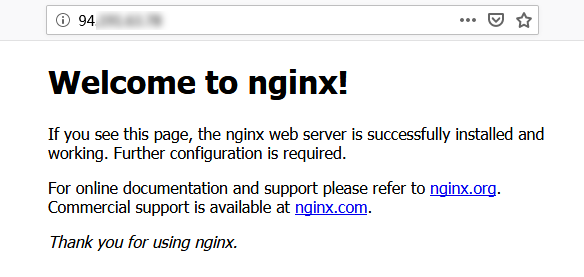

## 安装 Nginx

1、执行以下命令，在 /etc/yum.repos.d/ 下创建 nginx.repo 文件
```
//yum.repos.d是包管理工具yum安装各种应用的配置文件夹
vi /etc/yum.repos.d/nginx.repo
```

2、按 “i” 或 “Insert” 切换至编辑模式，写入以下内容(CentOS 7.6 请写入以下内容)
```
[nginx] 
name = nginx repo 
baseurl = https://nginx.org/packages/mainline/centos/7/$basearch/ 
gpgcheck = 0 
enabled = 1
```

3、按 “Esc”，输入 “:wq”，保存文件并返回

4、yum install nginx

5、执行以下命令，打开 nginx.conf 文件
```
vim /etc/nginx/nginx.conf
```

6、按 “i” 或 “Insert” 切换至编辑模式，对应使用的操作系统编辑 nginx.conf 文件，配置 Nginx，实现与 PHP 的联动
```
//找到 nginx.conf 文件中的 #gzip on;，另起一行并输入以下内容
server {
    listen       80;
    root   /usr/share/nginx/html;
    server_name  localhost;
    #charset koi8-r;
    #access_log  /var/log/nginx/log/host.access.log  main;
    #
    location / {
        index index.php index.html index.htm;
    }
    #error_page  404              /404.html;
    #redirect server error pages to the static page /50x.html
    #
    error_page   500 502 503 504  /50x.html;
    location = /50x.html {
    root   /usr/share/nginx/html;
    }
    #pass the PHP scripts to FastCGI server listening on 127.0.0.1:9000
    #
    location ~ .php$ {
    fastcgi_pass   127.0.0.1:9000;
    fastcgi_index  index.php;
    fastcgi_param  SCRIPT_FILENAME  $document_root$fastcgi_script_name;
    include        fastcgi_params;
    }
}
```

7、按 “Esc”，输入 “:wq”，保存文件并返回

8、依次执行对应命令启动 Nginx 并设置为开机自启动
```
systemctl start nginx
systemctl enable nginx
```

9、在浏览器中，输入云服务器实例公网 IP，查看 Nginx 服务是否正常运行
